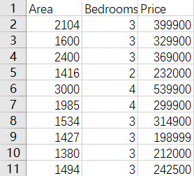
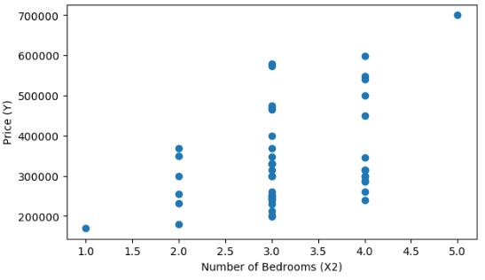
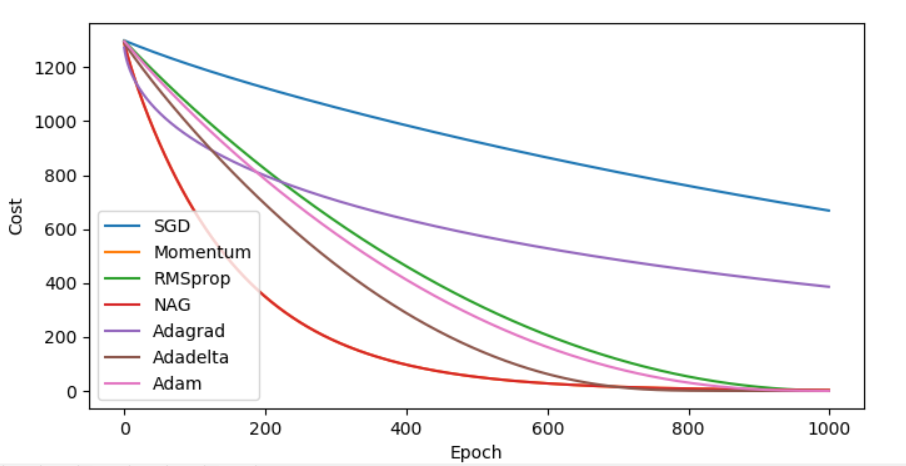
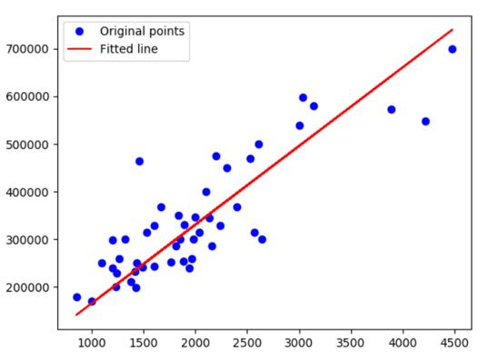

# SGD-Comparison                 
## Purpose     
Comparison of the stochastic gradient descent based on multiple linear regression. 

## Description     
In this program,seven different approaches (SGD,Momentum,NAG,Adagrad, Adadelta,Rmsprop,Adam) based on multiple linear regression used in updating the weights were investigated.By selecting specific test functions, the advantages and disadvantages of each approach are compared with each other in terms of the minimum cost reached. The comparison results are shown graphically.

Dataset is like below(from Andrew Ng's Course Machine Learing) :

    
     
The learing rate is 0.01 and iterations is 1000.
## Requirements   
     
* tensorflow
* pandas
* numpy
* matplotlib

## Visualization
* Scatter plot    

     
     
     

* Performance results    
  

* Fitting line     
  
